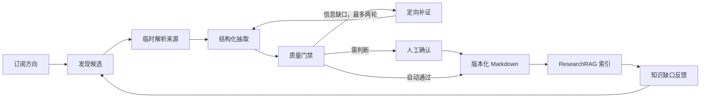

# Research Pulse：个人科研知识库

## 一句话定位

Research Pulse 是一个持续演化的**个人科研知识库**：用户围绕研究方向阅读、积累和追问论文知识；系统在后台把论文、新闻、博客和开源项目转化为带来源、质量门禁和版本的 Markdown 知识资产，自研 ResearchRAG 负责可过滤、可追溯的检索与问答。

它不是任务编排面板或通用论文工作台，不保存用户的永久 PDF 馆藏，不重新实现向量数据库，也不把“模型总结”直接当成知识。LangGraph 生产图是不可见的后台机制，而不是首页的主角。

## 目标闭环



## 生产图：LangGraph 的唯一职责

LangGraph 只编排长时、可恢复、可能循环的生产任务。模型调用、Docling、arXiv、Semantic Scholar 和 ResearchRAG 都是节点内部的 adapter，不应在图中承担状态所有权。

当前已落地的 `ProductionService` 把“单篇候选的解析 → 抽取 → 质量门禁 → 发布”封装为一个可替换的深模块；后台 LangGraph 的 `run_batch` 节点只协调批次、候选 ID 和发布回执。这样可保证临时全文、锚点片段和模型提示词不进入 checkpoint。真实 arXiv/Docling/DeepSeek adapter 将按该接口接入，不能绕过 `validate_draft` 直接写索引。

| 节点 | 输入 | 输出 | 规则 |
| --- | --- | --- | --- |
| `discover_candidates` | 订阅或知识缺口 | 候选列表 | 来源适配器可替换；对每轮数量设上限。 |
| `parse_source` | 已选候选 | 临时结构化材料、解析质量 | PDF/网页只在临时目录中存在；解析失败只能生成摘要级草稿。 |
| `extract_claims` | 有界材料 | 知识草稿、主张、证据锚点 | 事实、推断、待验证问题强制分型。 |
| `validate_draft` | 草稿与临时材料 | 通过、补证、人工确认或拒绝 | 见“质量门禁”。 |
| `search_missing_evidence` | 明确缺口 | 至多 N 篇相关候选 | 仅补特定维度，不做无限引用网络扩张。 |
| `human_review` | 草稿和失败原因 | 批准、编辑、拒绝 | 通过 LangGraph `interrupt()` 进入，恢复时沿用同一 run。 |
| `publish_asset` | 已批准 Markdown | 版本、发布回执 | 先写本地资产，再导入消费端；导入失败不影响资产版本。 |

建议首版限制：最多 3 个初始候选、2 篇补充材料、2 次补证循环；超限一律进入人工确认，不能静默降低门槛。

### 最小状态

图状态只保存 `run_id`、订阅/缺口 ID、候选 ID、资产草稿 ID、证据锚点 ID、预算、循环次数和决定理由。完整 PDF、完整解析文本、模型隐藏推理和检索向量都不放入状态或 checkpoint。

checkpoint 使用 SQLite 起步；单机 Docker 部署后替换为 Postgres。`interrupt()` 用于编辑草稿、选择补充材料、处理高风险校验失败，以及消费端的“是否补充知识”显式确认；它不能替代普通聊天的每轮状态管理。

## 节点 4：质量门禁

“让同一个模型自我反思”不是幻觉校验。`validate_draft` 必须按下列顺序执行，且任一阻断项失败就不能发布。

1. **结构校验**：Markdown front matter、来源 URL、版本、主张类型和锚点字段齐全。
2. **可定位校验**：每个 `source_fact` 的锚点能在本轮临时解析材料中解析到；摘要材料不得锚定实验、公式、表格或复现结论。
3. **实体校验**：数值、数据集、模型名、方法名必须在相应锚点文本中出现；不一致即删除或人工确认。
4. **蕴含校验**：用独立、受限提示词的模型只判定“锚点是否支持该主张”；返回 `supported / ambiguous / unsupported`，不能创造新事实。`unsupported` 阻断，`ambiguous` 转人工确认。
5. **去重与新颖性校验**：优先 DOI、arXiv ID、canonical URL，其次规范化标题；结论相似但来源不同则建立关联，而不是覆盖旧版本。
6. **覆盖度校验**：一篇“精读”至少覆盖问题、方法、结果和局限；缺任一项只能发布成标注范围的快讯或摘要卡，不能冒充精读。

`agent_inference` 和 `reading_question` 可以发布，但必须以醒目标签展示，且永远不得通过消费端提示词变成“论文事实”。

当前第一段已在 `research_pulse/production/quality.py` 落地：`source_fact` 必须有可解析锚点，锚点 URL 必须属于该资产来源，主张中的数值必须在锚点片段中出现；独立蕴含判定器返回 `unsupported` 会阻断发布，未接入判定器时只能进入人工复核。DeepSeek 的生成调用与独立判定器会使用不同、受限的 adapter，不能把同一次生成的“自我反思”视作验证。

## 资产与版本

```text
knowledge/
  papers/<source-id>/<version>.md
  updates/<date>-<slug>.md
  projects/<repo>-<commit>.md
  manifests/<asset-id>.json
  gaps/<gap-id>.json
```

- 每份 Markdown 记录 `asset_id`、`version`、`source_urls`、`evidence_level`、`claim_count`、`content_hash`。
- 内容变化产生新版本；旧版本只读保留。
- `manifest` 保存发布到哪个索引 document/chunk、何时发布和失败原因。
- 不保存源 PDF；Markdown 不复制论文全文，只保留归纳、来源链接和可定位锚点。

### 论文与知识不在同一个仓

个人研究仓还维护一个轻量文献目录，例如 `catalog/papers.jsonl`。每条 Paper Record 只保存 DOI/arXiv ID、标题、作者、年份、来源 URL、标签和是否已精读；它不是全文，也不会自动进入检索索引。只有产生并通过门禁的 Knowledge Asset 才会进入 `knowledge/` 与 ResearchRAG。

旧论文导入遵循分级迁移：有 DOI/arXiv/URL 的论文先成为 Paper Record；用户显式选择的本地 PDF 仅为本次解析临时读取，随后删除临时副本；只有书目没有可访问正文的条目保留为“待读”，不能生成事实型知识。不得一次性把历史 PDF 批量丢给检索索引。

## 自研 ResearchRAG：可评测的科研检索内核

ResearchRAG 不是通用文档平台，只服务已发布的 Markdown。第一切片以 PostgreSQL FTS 返回包含 asset/version/anchor 的 `EvidenceHit`；随后增加 pgvector dense 召回、RRF 融合、MMR 多样性、时间去偏和可选 reranker。每一层在接入前都要先补齐回归评测。

| 层 | MVP 职责 | 明确不做 |
| --- | --- | --- |
| 摄取 | 解析 front matter、创建 document/chunk、生成 embedding | 通用文件上传与 PDF 解析 |
| 检索 | metadata/current-version filter、keyword+dense、RRF、MMR | 网页搜索、图谱、多租户 |
| 问答 | 将 EvidenceHit 交给受控回答节点并渲染引用 | 自由 Agent、无来源补全 |
| 评测 | 检索、groundedness、拒答与版本回归 | 用单次主观演示替代评测 |

运行规则：

- 只摄取通过门禁的 Markdown；PDF 仅属于生产期的临时输入。
- 强制 metadata filter：`publication_status=published`、当前版本、领域和 `evidence_level`；草稿永不参与问答。
- Markdown 是事实来源；chunk、embedding 与索引全部可重建。

## 消费端的知识缺口

消费端不能把“没有检到”伪装成答案。首版提供一个显式的 **报告知识缺口** 操作：用户填写问题、期望回答维度和关联订阅；系统创建 `KnowledgeGap` 并投入下一次生产任务。

消费 API 先调用 ResearchRAG `search`，再检查命中数、检索分数与证据锚点覆盖。若不足，就返回“当前库证据不足”，并建议创建 `KnowledgeGap`；不能让回答模型在未经确认时补答。首版由用户显式创建缺口，完成真实问答评测后才增加半自动建议。

## MVP

1. 一个 arXiv 订阅；每天发现不超过 3 篇。
2. 临时全文解析 + 摘要级降级。
3. 结构化 Markdown 草稿、锚点校验、人工确认。
4. 版本化写入本地 `knowledge/`；摄取到 ResearchRAG，并验证 metadata filter、RRF 与 MMR。
5. 手动创建知识缺口并定向重跑。

不做：通用文件平台、图像视觉理解、新闻/博客、自动缺口识别、全网搜索、第二套向量库、多租户和知识图谱。

## 前端

使用 **React + TypeScript + Vite**。首页以论文精读时间线和阅读页面为中心；全局知识库问答从右上角进入，对当前论文的追问自动带入其 asset scope。前端只负责展示和调用 FastAPI：不保存业务规则、不直接访问数据库，也不直接调用模型或检索内核。
